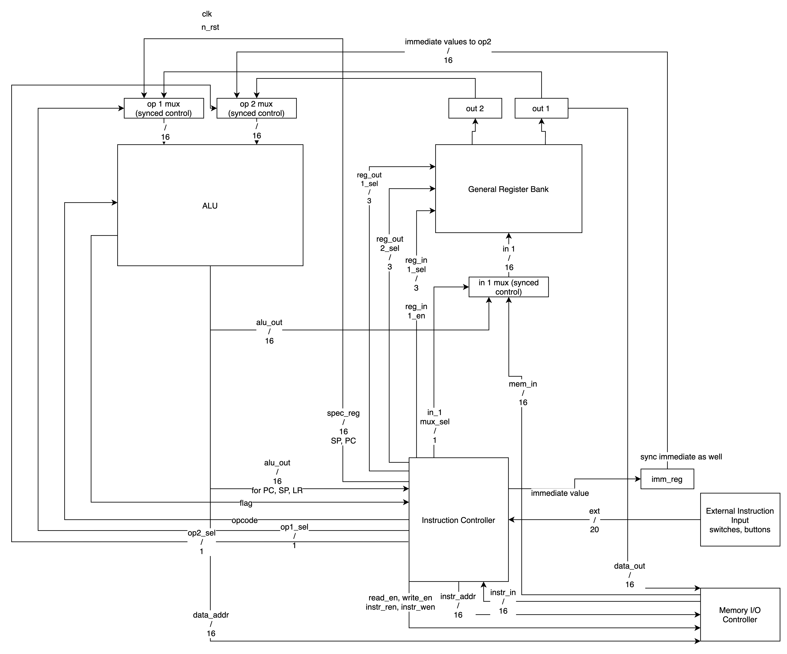
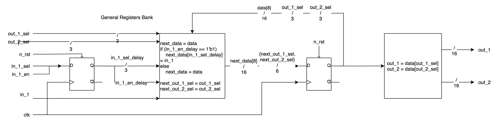

# Zenomial

A **simple** opensourced customized 16-bit harvard architecture processor with minimum instruction set for education purposes with inspiration from the ARMv6-M Architecture.

Implemented with Alinx A301 FPGA development board.

## Development Schedule

### Todos

* [ ] RTL Diagram (Due Feb 24)
  * [ ] Top level RTL Diagram
  * [ ] Supporting block diagram for each submodule
* [ ] System Verilog Development
  * [ ] Add modules
* [ ] Unit Testing
  * [ ] Software simulation and test for each submodule using modelsim
  * [ ] Hardware simulation and test for each submodule on FPGA
* [ ] Integration Testing
  * [ ] Software simulation and test using modelsim
  * [ ] Hardware simulation and test using FPGA
* [ ] CI/CD on GitHub?
* [ ] Rearrange README as wiki
* [ ] Programming
  * [ ] Assembler development
* [ ] Peripherals Development
* [ ] Flexible design?
* [ ] Von Neumann Architecture?
* [ ] More stages for pipeline
  * [ ] Refer to RISC design

## Core Modules

* ALU
* Memory Controller / Bus
  * Instruction Mem
  * Data Mem (12 bits)
  * Memory Space
    * 16 bit address
    * First 4 bits used to identify SOC devices
* General Register groups (8)
* FSM Controller
  * Control the instruction fetch-decode-execute cycle
  * Special registers
    * Intruction register
      * hold the current instructions
    * Program Counter (PC)
      * Next instruction
    * Stack pointer
    * Link register
* Clock

## Executation Pipeline

| First Clock | Second Clock  | Third Clock|
|:-----------:|:-------------:|:----------:|
| Fetch       | Fetch         | Fetch      |
|             | Decode        | Decode     |
|             |               | Execute    |

## Peripherals

* UART Port
* AHB
* APB
* I2C
* SPI
* GPIO
* Timers
* BUS matrix to interact with peripherals

## Functionality

* Stack operation
* Arithmetic and logic operations
* Branching
* Memory accessing and storing
* Instruction input methods
  * Flash input
  * DIP Button input
    * Use DIP button to encode instruction and save in instruction register
    * Old Atari style
  * Choose either to save instruction in flash (programming) or run the instruction immediately
* **No** Interrupts or exception handler currently

## RTL Diagram

### TOP Level Design

### Individual Block Diagram

#### ALU

#### General Register

#### Controller

## Instruction Set

Same mnemonic as the ARMv6-M Architecture

### Opcode Descrption

|Opcode|xxxxxxxxxxxx|

* [00](#arithmetic-operation)
* [01](#logic-operation)
* [10](#register-loading-and-memory-accessing)
* [11](#branching--stack-operation)

### Arithmetic Operation

* Addition
  * Adds immediate
  * Adds register
  * Adds with carry, register
* Subtraction
  * Subs immediate
  * Subs register
  * Subs carry register
  * Reverse subs
* Multiplication
  * Mulipcation of two integer

### Logic Operation

* AND
  * AND immediate?s
  * AND register
* OR
  * OR immediate?
  * OR register
* NOT
  * neg register
* XOR
  * eor register
* BIC
  * bics immediate?
  * bics register
* Shift
  * Left shift
  * Right shift
    * Arithmetic shift
    * Logic shift
  * Rotate Right
* ~~Extension?~~
  * Sign Extension
  * Unsigned Extension

### Register Loading and Memory Accessing

* Load
  * ldr word
  * ldrb byte
* Store
  * str word
  * strb byte
* Move
  * movs immediate
  * movs register

### Branching & Stack operation

* Compare
  * CMP immediate
  * CMP Register
* Branching
  * b unconditional branching
  * b[] conditional branching
  * bl branch with link register
  * bx branch to an address in a register
  * blx branch to an address in a register and store the next line of code in link register
* Push
* Pop
